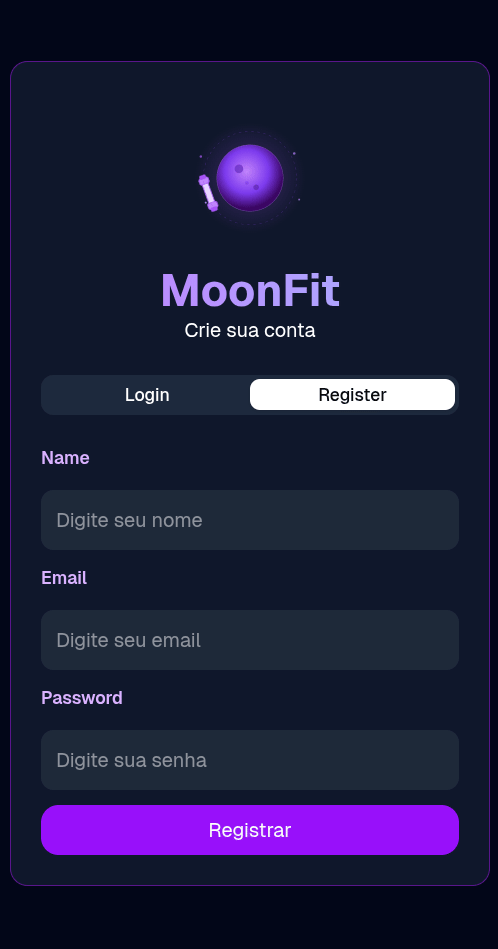

<div align="center">


### Interface web do MoonFit

[](https://react.dev/)
[](https://vitejs.dev/)
[](https://www.typescriptlang.org/)
[](https://tailwindcss.com/)
[](https://react-hook-form.com/)
[](https://zod.dev/)
[](https://tanstack.com/query)
[](https://pnpm.io/)

</div>

---

## 📚 Sobre

Frontend do MoonFit — interface para autenticação e gerenciamento de treinos, consumindo a [API REST do backend](../backend/README.md).

> Primeiro projeto frontend com integração real a uma API própria.

---

## 📸 Preview

<details open>
<summary>Tela de Login e Cadastro</summary>

<br/>

<div align="center">
  
</div>

</details>

## 🎯 Funcionalidades

- [x] Tela de Login e Register (com tabs animadas)
- [x] Logo SVG animado
- [x] Formulários com validação (RHF + Zod)
- [x] Integração com a API via Axios + TanStack Query

---

## 🏗️ Estrutura

<details>
<summary>Ver estrutura de arquivos</summary>

```
src/
├── components/
│   ├── ui/              # Componentes Shadcn (Tabs, etc.)
│   └── MoonLogo.tsx     # SVG animado
├── lib/
│   ├── axios.ts         # Instância configurada do Axios
│   └── utils.ts
├── pages/
│   ├── Login.tsx
│   └── Register.tsx
├── schemas/             # Schemas Zod de validação
├── App.tsx
├── main.tsx
└── index.css
```

</details>

---

## 🚀 Como Executar

### Pré-requisitos

- Node.js 24 LTS
- pnpm
- Backend rodando em `http://localhost:3333`

### Setup

**1. Entre na pasta:**

```bash
cd frontend
```

**2. Instale as dependências:**

```bash
pnpm install
```

**3. Configure as variáveis de ambiente:**

```bash
cp .env.example .env
```

**4. Inicie em desenvolvimento:**

```bash
pnpm dev
```

✅ App disponível em `http://localhost:5173`

---

## 🗺️ Rotas

| Rota        | Página   | Auth |
| ----------- | -------- | ---- |
| `/`         | Login    | ❌   |
| `/register` | Register | ❌   |

---

## 📝 Variáveis de Ambiente

```env
VITE_API_URL=http://localhost:3333
```

---

## 📖 Aprendizados

- [x] Estruturação de um projeto frontend do zero com Vite
- [x] Componentização com React e TypeScript
- [x] Estilização com Tailwind CSS e Shadcn/ui
- [x] Gerenciamento de formulários com React Hook Form
- [x] Validação de schemas com Zod
- [x] Requisições e cache com TanStack Query + Axios
- [x] Roteamento com React Router

---
